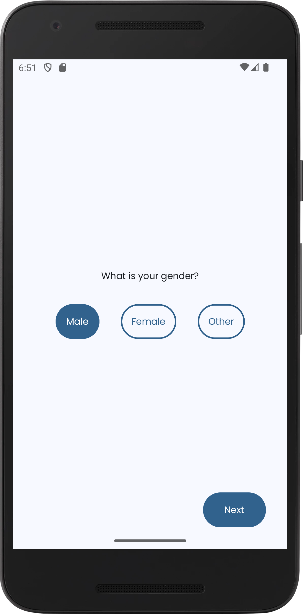
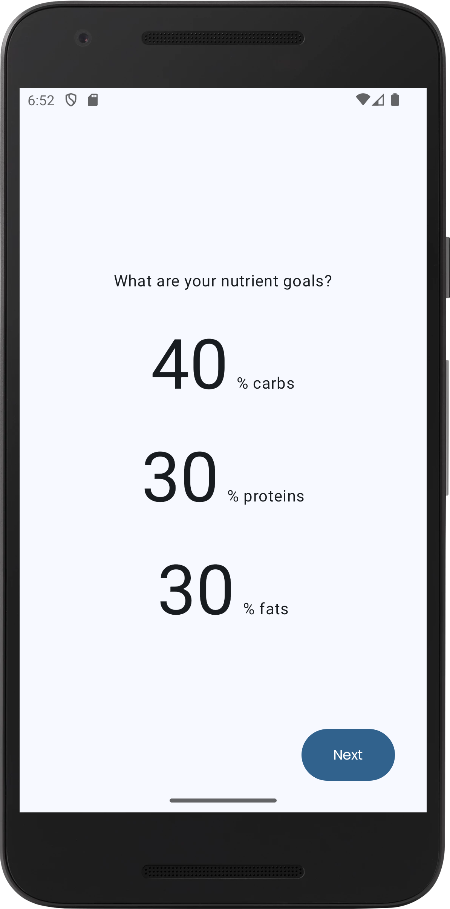
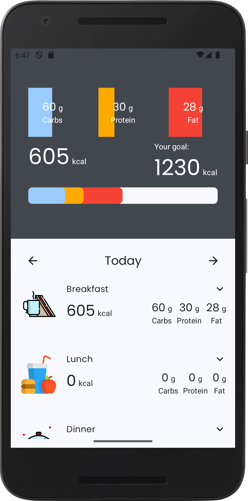
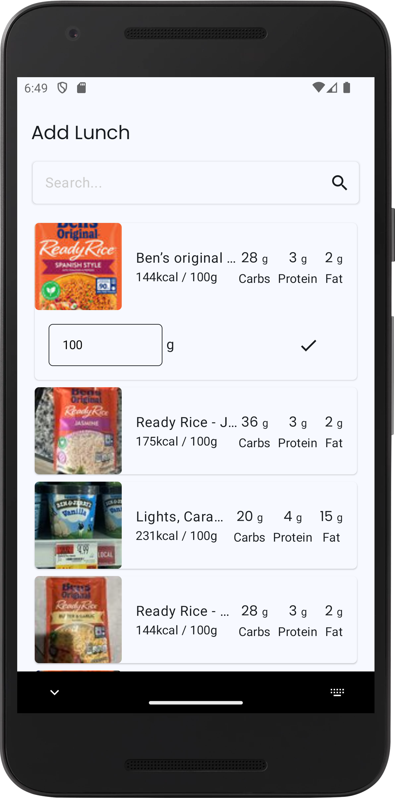
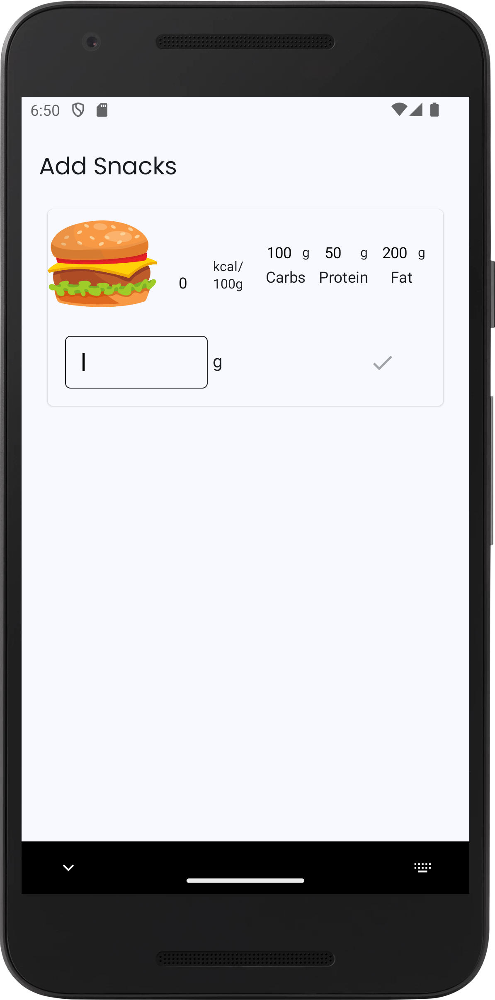

## Calories — Track daily calories and macros effortlessly

An Android app to log meals, calories, and macronutrients. Search foods via OpenFoodFacts or add custom items for fast, accurate tracking.

## Table of Contents
- [Features](#features)
- [Visual Tour](#visual-tour)
- [Technical Architecture](#technical-architecture)
- [Offline-First Design](#offline-first-design)
- [Key Technologies & Libraries](#key-technologies--libraries)
- [API Interaction](#api-interaction)
- [Requirements](#requirements)
- [Setup & Installation](#setup--installation)
- [Future Enhancements](#future-enhancements)
- [Design & Mockups](#design--mockups)

## Features
- **Guided onboarding**: Capture gender, age, height, weight, activity level, goal, and macro split to personalize targets.
- **Daily tracker overview**: See calories/macros at a glance with per-meal breakdowns (Breakfast, Lunch, Dinner, Snacks).
- **Food search**: Query OpenFoodFacts, preview nutrition, and track precise amounts in grams.
- **Custom items**: Add your own foods when search results don’t fit.
- **Quick day navigation**: Jump to yesterday/tomorrow and review what you logged.
- **Inline feedback**: Snackbars for actions and errors.
- **Persistent storage**: Your tracked foods and preferences are saved locally.

## Visual Tour
> Screenshots live under ./logo/screenshots.

### Onboarding — Enrollment
Enter your basic information to personalize calorie and macro targets.


### Onboarding — Goals
Choose your goal and macro split to tailor daily targets.


### Tracker Overview
See daily calories and macros, per-meal breakdowns, and navigate between days.


### Search — Add Product
Search OpenFoodFacts, inspect nutrition details, and track exact gram amounts.


### Search — Add Custom Item
Create and track custom foods when search results don’t match your needs.


## Technical Architecture
- **Presentation/UI**: Jetpack Compose (Material 3), ViewModels with StateFlow, Navigation Compose with type-safe routes.
- **Domain/Logic**: Use cases (search, track, delete, calculate nutrients, get foods for date); models `TrackableFood`, `TrackedFood`, `MealType`; input validation for macro goals.
- **Data**: Retrofit + Moshi to OpenFoodFacts; Room (`TrackerDatabase`, `TrackerDao`, `TrackedFoodEntity`) for local persistence; repository (`DefaultTrackerRepository`) coordinates remote and local sources.
- **DI/Composition**: Hilt modules wire networking, database, repository, and app preferences.

## Offline-First Design
- Tracked foods and user preferences are stored locally (Room + SharedPreferences), so history and totals remain available offline.
- Food search requires network connectivity; when offline, you can still add custom items and view previously logged data.

## Key Technologies & Libraries
- **Language**: Kotlin (2.0.21)
- **UI Toolkit**: Jetpack Compose (Material 3)
- **Networking**: Retrofit, OkHttp (Logging Interceptor), Moshi
- **Local Storage**: Room
- **Async/Concurrency**: Kotlin Coroutines + Flow
- **DI**: Hilt
- **Navigation**: Navigation Compose (+ Kotlin Serialization routes)
- **Images**: Coil 3

## API Interaction
- **Base URL**: `https://us.openfoodfacts.org/`
- **Endpoints**:
  - `GET /cgi/search.pl` — Search foods by name (params: `search_terms`, `page`, `page_size`; fixed: `search_simple=1`, `json=1`, `action=process`, `fields=product_name,nutriments,image_front_thumb_url`).
- **Auth**: None

## Requirements
- **Platform**: Android 8.0+ (minSdk 26), targetSdk 35
- **Tooling**: Android Studio (latest), Gradle 8.9, JDK 11+, Kotlin 2.0.21
- **Permissions**: Internet access (`android.permission.INTERNET`)

## Setup & Installation
1. **Clone the repository**
   ```bash
   git clone <repo-url>
   cd <project-directory>
   ```
2. **Open in Android Studio (recommended)**
   - File → Open… → select the project root
   - Let Gradle sync and index
3. **Build from command line (optional)**
   ```bash
   ./gradlew clean assembleDebug
   ```
4. **Run on device/emulator**
   ```bash
   ./gradlew installDebug
   ```
   Or use Android Studio’s Run button with the `app` configuration.

## Future Enhancements
- Barcode scanning to speed up food entry.
- Smart goal recommendations and weekly coaching insights.
- Cloud backup/sync across devices.

## Design & Mockups
- Built with Material 3 theming and Compose components for a modern, accessible UI.
- If you maintain design artifacts, place them under `docs/` for easy reference.
